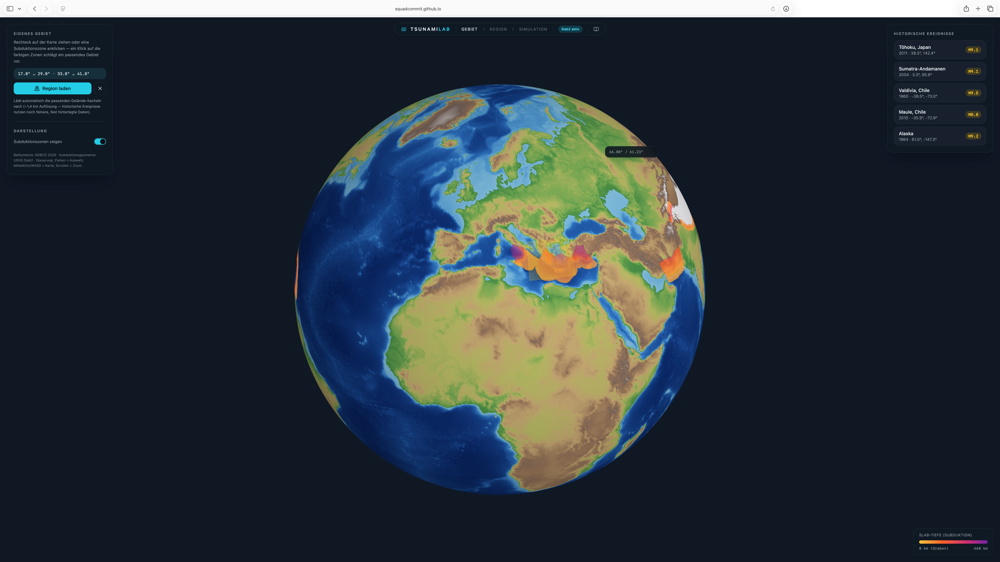

13. Project Report: Interactive Real-Time Tsunami Simulation
==============================================================

.. contents:: On this page
   :local:
   :depth: 2

Abstract
--------

The individual phase turned the batch finite-volume solver of the course phase
into an interactive, physically motivated tsunami laboratory. The work passed
through three stages:

1. a real-time 3D visualization implemented directly against the OpenGL API,
   without a 3D engine or rendering library;
2. a physically motivated earthquake source, replacing the initial Gaussian
   bump with an Okada rectangular-dislocation model driven by published scaling
   laws, real subduction-zone geometry and the Tanioka & Satake
   sloping-seafloor correction;
3. a port of the whole application to the browser: the same C++ solver and the
   same renderer, compiled to WebAssembly and WebGL2 behind a React frontend,
   publicly deployed.

Stages 1 and 2 are the project as it was planned and presented. Stage 3 was
added afterwards, voluntarily, once the project itself was already finished;
see :ref:`project-scope` below.

The result is a tool where the user picks an area on a globe, sets a
moment magnitude and clicks a location, and then watches a tsunami propagate
live over GEBCO bathymetry. The fault behind that tsunami takes its depth,
strike and dip from the USGS Slab2 model and its length, width and slip from
interface-earthquake scaling relations.

**Live application:** https://squadcommit.github.io/Riptide/

Starting point and goal
-----------------------

At the end of the course phase the project was a competent but entirely offline
pipeline. ``WavePropagation2d`` stepped a grid, ``main.cpp`` drove a time loop,
and every output went through a NetCDF or CSV writer to be inspected afterwards
in ParaView. Between starting a simulation and seeing a result there was a long
non-interactive wait, and the result was a pre-rendered animation: the
parameters were fixed before the run started, so any change of magnitude,
location or region meant configuring and running the whole simulation again.

The goal of the individual phase was to close that loop:

* **Real time.** The solver runs continuously in the background and the wave is
  visible as it develops, at interactive frame rates and without file I/O.
* **Interactive.** The user chooses the region and triggers the earthquake by
  clicking on the seafloor, with no configuration files and no intermediate
  steps.
* **Physically defensible.** The initial condition is not a hand-tuned bump. A
  magnitude and a location are enough, and everything between them and the
  water surface is derived from published seismological models.

The third point took by far the most research effort and is treated in its own
section below.

.. _project-scope:

Project scope
-------------

The project as planned, implemented and presented consists of the interactive
OpenGL application and the physical source model, that is stages 1 and 2 above.
Last Bugfixes of that version are tagged in https://github.com/SquadCommit/Riptide/releases/tag/v0.1.1.

.. figure:: ../_images/individual_phase/globe_view.png
   :alt: Globe view with a selection rectangle over Southeast Asia
   :width: 85%

   Entry point: a global bathymetry view with the Slab2 subduction zones
   overlaid. A drag selects the simulation domain.

Everything after that tag was optional. The migration from ``nix-shell`` to
Docker Compose, the WebAssembly and WebGL2 port, the React frontend, the tiled
data pipeline and the public deployment were not part of the original plan.
They were built in the two weeks afterwards
simply because the team wanted to keep working on the project and because a
desktop binary requiring a 7.5 GB dataset and a C++ toolchain reaches almost
nobody, whereas a URL reaches everybody.

   Entry point of the web UI: a global bathymetry view with the Slab2 subduction zones
   overlaid. A drag selects the simulation domain.

Part I: The renderer
----------------------

The visualization is implemented directly against the OpenGL API. The project
does not use a 3D engine, a scene graph or a rendering library. The four
third-party libraries it links cover windowing, function loading, UI widgets
and vector maths:

=====================  ======================================================
Library                Role
=====================  ======================================================
GLFW                   OS window, mouse and keyboard events
GLAD                   Runtime resolution of OpenGL function pointers
Dear ImGui             2D sidebar widgets of the desktop UI
glm                    Vector and matrix maths
=====================  ======================================================

Buffer management, shader handling, the camera, mouse picking, the
level-of-detail scheme and all GLSL were written for this project.

**Meshes.** Terrain and water are regular ``nx × ny`` grids, held as a VAO with
a static XZ-position buffer, a dynamic height buffer and an index buffer of two
triangles per quad. Only the height attribute is re-uploaded per frame, via
``glBufferSubData``; positions and indices are uploaded once at load time. The
upload also strips the solver's ghost layer, so the renderer never sees a
boundary cell.

**Shaders.** ``Shader.h`` handles source loading, compilation, linking and
uniforms. The GLSL consists of 11 files under ``src/visualization/shaders/``:
vertex and fragment pairs for the globe terrain, the selection rectangle, the
region terrain, the sea-level plane and the water surface. Hill shading is
derived per fragment from screen-space derivatives of the world position, so no
normals need to be stored or updated. Vertical exaggeration is applied in the
vertex shader and tapers toward 1× in shallow water, where shoaling already
amplifies the wave and full exaggeration produced extreme spikes at the coast.

**Camera and picking.** An orbit camera parameterised by target, distance,
azimuth and elevation produces its own view and projection matrices. Placing an
earthquake by clicking the seafloor requires unprojecting the cursor into a
world-space ray, intersecting it with the terrain and converting the hit point
back to geographic coordinates.

**Level of detail.** A GEBCO region at native resolution is far too dense to
draw at every zoom level. Eight index buffers are built over the same vertex
grid, sampling every 1st, 2nd, 4th and so on up to every 128th vertex. Each
level costs a quarter of the previous one, so the whole chain adds only about a
third to the index memory. Per frame the renderer picks the coarsest level
whose cells still cover roughly 1.5 pixels, since sub-pixel triangles add no
visible detail but multiply the MSAA fill cost, and it draws only the part of
the grid that survives frustum culling, as one contiguous index span per row.

Getting the translucent passes (sea-level plane, water sheet, Slab2 overlay) to
coexist correctly took a series of smaller fixes visible in the git history:
terrain culled at grazing camera angles, coastal seabed artefacts showing
through the water, speckling at far zoom, and a strip of bare seabed wherever
the coarse simulation shoreline disagreed with the fine terrain coast. The last
one was solved by snapping dry vertices to sea level in the vertex shader
instead of discarding them, so the water forms a gap-free sheet that land
occludes through the depth test.

.. figure:: ../_images/individual_phase/region_preview.png
   :alt: 3D bathymetry terrain preview of the selected region
   :width: 85%

   Region view: GEBCO bathymetry as a shaded 3D mesh with hypsometric
   colouring and a translucent sea-level plane.

Part II: Seafloor displacement
--------------------------------

This is where the project invested the most reading, derivation and validation
effort. The question is deceptively simple, namely what the water surface looks
like at :math:`t = 0` when the user says "magnitude 9.1, here", and answering it
required assembling five separate pieces of published seismology.

Why the Gaussian had to go
~~~~~~~~~~~~~~~~~~~~~~~~~~

The first implementation (``GaussianDisplacement``) was a radially symmetric
bell:

.. math::

   d(r) = A \exp\!\left(-\frac{r^2}{2\sigma^2}\right)

It is trivial to implement, it produces a plausible-looking wave, and it is
physically meaningless. Its amplitude and width are free parameters with no
connection to any earthquake. It is radially symmetric, whereas real megathrust
ruptures are strongly elongated along strike. And it produces only uplift,
whereas real co-seismic deformation pairs uplift over the shallow part of the
fault with subsidence behind it. That uplift/subsidence dipole is what
determines whether the wave arrives as a leading depression or a leading
elevation, so a tsunami started from a Gaussian is a nice animation of the
solver and says nothing about the earthquake.

Replacing it defined the second half of the individual phase.

The chain from magnitude to water surface
~~~~~~~~~~~~~~~~~~~~~~~~~~~~~~~~~~~~~~~~~~~

The user supplies exactly two things: a moment magnitude :math:`M_w` and a
click location :math:`(\lambda, \varphi)`. Everything else is derived:

.. code-block:: text

   user click + Mw
          │
          ├─► Slab2 (Hayes et al. 2018)      ──► depth, strike, dip
          │      └─ also acts as a plausibility filter (NaN = not a
          │         subduction interface, so the source is rejected / fallback on Wells & Coppersmith)
          │
          ├─► Strasser et al. (2010)          ──► length L, width W
          │      └─ slip D from moment consistency, not a regression
          │      └─ fallback outside Slab2: Wells & Coppersmith (1994)
          │
          └─► fixed assumptions               ──► rake 90°, ν = 0.25
                          │
                          ▼
              Okada (1985 / 1992)  ──►  u_z, and u_x / u_y
                          │
                          ▼
              Tanioka & Satake (1996) correction over sloping seafloor
                          │
                          ▼
              effective vertical displacement  ──►  initial sea surface

Okada (1985 / 1992): the dislocation model
~~~~~~~~~~~~~~~~~~~~~~~~~~~~~~~~~~~~~~~~~~~~

`Okada (1985) <https://doi.org/10.1785/BSSA0750041135>`__ derives the static
surface displacement produced by a rectangular dislocation buried in a
homogeneous, isotropic elastic half-space. `Okada (1992)
<https://doi.org/10.1785/BSSA0820021018>`__ extends the closed-form epressions
to internal deformation and tidies up several singulaxr cases. The half-space
assumption trades geological realism for closed-form tractability: no
volumetric mesh and no numerical PDE solve are needed, so the field can be
evaluated per grid cell at negligible cost, which is exactly what an
interactive application needs.

A single fault plane is described by nine parameters: centroid position
:math:`(x, y)`, depth of the top edge :math:`d`, strike :math:`\phi`, dip
:math:`\delta`, rake :math:`\lambda`, along-strike length :math:`L`, down-dip
width :math:`W` and slip magnitude :math:`U`. These map one-to-one onto the
``OkadaDisplacement`` constructor.

The implementation (``src/displacement/OkadaDisplacement.cpp``) is a direct
transcription of the closed-form solution and is genuinely fiddly:

* The query point is rotated into the fault-local frame where :math:`+x` runs
  along strike, using the geographic strike convention (clockwise from North),
  and rotated back afterwards.
* The rectangle is evaluated in Chinnery's notation, so the field is the
  alternating sum :math:`f(\xi_2,\eta_2) - f(\xi_2,\eta_1) - f(\xi_1,\eta_2) +
  f(\xi_1,\eta_1)` over the four fault corners.
* The auxiliary terms :math:`I_1` … :math:`I_5` all contain a
  :math:`1/\cos\delta` factor that diverges for a vertical fault, so each one
  carries an explicit :math:`\cos\delta \to 0` limit branch, plus epsilon
  guards on every denominator and logarithm argument.

Only the vertical component drives the tsunami initial condition, but the
horizontal components :math:`u_x, u_y` (Okada 1985, eqs. 25/26) are computed as
well, because the Tanioka & Satake correction below needs them.

Validation against ``okada85.m``
~~~~~~~~~~~~~~~~~~~~~~~~~~~~~~~~~

The Okada equations are notoriously error-prone to transcribe. Sign
conventions, angle definitions and singularity handling all invite mistakes
that produce fields which look right and are quantitatively wrong, and a
self-consistency test would not catch that.

The implementation was therefore cross-checked against
`okada85.m <https://github.com/IPGP/deformation-lib/blob/master/okada/okada85.m>`__
from the IPGP ``deformation-lib`` package, the widely used MATLAB reference
implementation, run unmodified in Octave 11.3.0:

* 81 configurations were compared: 9 fault parameter sets times 9 query points,
  spanning thrust, normal, oblique and pure strike-slip rakes, dips from 10° to
  the near-vertical 89° singularity, and both centroid and off-centre queries.
* The maximum deviation was about :math:`5 \cdot 10^{-11}` absolute and
  :math:`8 \cdot 10^{-9}` relative, which is floating-point noise rather than a
  systematic error.
* Seven of those cases are pinned as regression tests in
  ``OkadaDisplacement.test.cpp`` with their reference values to ten significant
  digits, alongside symmetry tests, far-field decay tests and a brute-force
  finiteness sweep over dips {1°, 45°, 89.9°, 90°}, rakes {0°, 45°, 90°, -90°}
  and several depths, asserting that no input produces NaN or Inf.

Fault geometry: Wells & Coppersmith vs. Strasser et al.
~~~~~~~~~~~~~~~~~~~~~~~~~~~~~~~~~~~~~~~~~~~~~~~~~~~~~~~~~

Okada needs :math:`L`, :math:`W` and :math:`U`, while the user supplies only
:math:`M_w`. Closing that gap required a scaling relation, and the obvious
first choice turned out to be the wrong one.

`Wells & Coppersmith (1994) <https://doi.org/10.1785/BSSA0840040974>`__ is the
classic reference:

.. math::

   \begin{aligned}
   \log_{10}(RLD) &= -2.44 + 0.59\,M_w \\
   \log_{10}(RW)  &= -1.01 + 0.32\,M_w \\
   \log_{10}(AD)  &= -4.80 + 0.69\,M_w
   \end{aligned}

Reading the paper rather than just the equations revealed the problem. The
regressions are calibrated on crustal earthquakes (strike-slip, reverse,
normal) up to about :math:`M_w` 8.1, and the authors explicitly exclude
subduction-interface events from the dataset. Extrapolated to the :math:`M_w`
9+ megathrust events that actually generate ocean-crossing tsunamis, they
produce ruptures that are far too long and far too narrow, with aspect ratios
beyond 10:1, which is not what a megathrust looks like.

`Strasser, Arango & Bommer (2010) <https://doi.org/10.1785/gssrl.81.6.941>`__
provides regressions calibrated specifically on subduction-interface
earthquakes:

.. math::

   \log_{10}(L) = -2.477 + 0.585\,M_w, \qquad
   \log_{10}(W) = -0.882 + 0.351\,M_w \quad \text{(km)}

The slip is deliberately not taken from a third independent regression. Three
independent fits do not have to be mutually consistent, and an inconsistent
triple silently produces a fault carrying the wrong seismic moment. The slip is
instead chosen so that the fault carries exactly the moment of the requested
magnitude:

.. math::

   D = \frac{M_0}{\mu L W}, \qquad M_0 = 10^{1.5 M_w + 9.1}\ \text{N\,m},
   \qquad \mu = 40\ \text{GPa}

With this construction :math:`M_w` 9.1 yields a fault of roughly 702 km by
205 km with about 9.8 m of average slip, against published Tohoku 2011 source
models of roughly 450 km by 200 km with about 10 m of slip, so width and slip
land essentially on target. Wells & Coppersmith is kept as the fallback for
locations outside Slab2 coverage, where the interface relations do not apply
anyway.

Slab2 (Hayes et al. 2018): real fault geometry and a validity filter
~~~~~~~~~~~~~~~~~~~~~~~~~~~~~~~~~~~~~~~~~~~~~~~~~~~~~~~~~~~~~~~~~~~~~~

The remaining parameters, the depth, strike and dip of the interface at the
clicked location, come from `Slab2 <https://doi.org/10.1126/science.aat4723>`__
(Hayes et al. 2018), the USGS global model of subduction-zone geometry,
distributed as 0.05°-spaced regular-grid rasters. A reader was written for it
(``src/io/Slab2Reader.cpp``, plus a wasm-safe query path), with automatic
first-run download of the ~140 MB ScienceBase archive.

Slab2 is used in two ways, and the second was the more interesting
realisation:

* **As a parameter source.** The fault is oriented along the real slab
  interface instead of a guessed strike and dip, so a source placed off Honshu
  automatically gets the Japan Trench geometry and one placed off Chile gets the
  Peru-Chile Trench geometry.
* **As a plausibility filter.** Slab2 stores *NaN* wherever a cell lies outside
  a modelled slab. That doubles as a validity test at zero extra cost: a
  magnitude-9 source requested in the middle of the Atlantic samples NaN and is
  rejected, so the application cannot be used to place physically impossible
  megathrust earthquakes on passive margins or abyssal plains.

The same coverage information is rendered back to the user. The globe and the
region view both draw a depth-graded Slab2 overlay, so it is visible before
clicking where a great earthquake can plausibly occur.

Tanioka & Satake (1996): the trench effect
~~~~~~~~~~~~~~~~~~~~~~~~~~~~~~~~~~~~~~~~~~~~

The standard simplification is to use only :math:`u_z` and ignore horizontal
seafloor motion, on the grounds that sliding a flat seabed sideways displaces
no water. On a steep slope that argument fails.

`Tanioka & Satake (1996) <https://doi.org/10.1029/96GL00736>`__ showed that
horizontal motion of a sloping seafloor contributes an effective vertical
displacement. A rigid horizontal shift :math:`(u_x, u_y)` moves the material
that used to be at :math:`(x - u_x,\, y - u_y)` to :math:`(x, y)`, so the
elevation seen at the fixed point :math:`(x, y)` changes, to first order, by
:math:`-(u_x \partial_x b + u_y \partial_y b)`:

.. math::

   u_z^{\text{eff}} = u_z - \left(u_x \frac{\partial b}{\partial x}
                              + u_y \frac{\partial b}{\partial y}\right)

This matters precisely where the interesting earthquakes are. Tohoku and Chile
both rupture next to a deep-sea trench, the steepest bathymetry on Earth, and
there the correction is not a rounding error. It is implemented in
``effectiveVerticalDisplacement()`` and applied in both the static preview and
the live simulation, with the bathymetry gradient taken from central
differences on the structured GEBCO grid (one-sided at the edges).

The design payoff is that the correction folds the horizontal components back
into a single effective vertical number per point, so the solver's
initial-condition interface never had to change. It still consumes one vertical
displacement per cell, exactly as it did with the Gaussian.

The correction is unit-tested independently of the Okada cross-check, since it
is a pure vector-calculus identity rather than an Okada-specific formula: zero
horizontal motion or flat seafloor must be a no-op, up-slope motion must raise
the fixed point and down-slope motion must lower it, with the magnitude given
by the gradient.

.. figure:: ../_images/individual_phase/displacement.png
   :alt: Okada seafloor displacement field
   :width: 85%

   The computed displacement field: uplift over the shallow part of the fault,
   subsidence behind it. This dipole structure is what a Gaussian cannot
   represent.

Honest assessment of the source model
~~~~~~~~~~~~~~~~~~~~~~~~~~~~~~~~~~~~~~~

Being able to state the limits of a model is part of building it.

* **Scaling laws are weakest exactly where tsunamis are strongest.** Since 1900
  there have been only five earthquakes of :math:`M_w \geq 9`, and no
  regression calibrated on a handful of events can be precise there. Concretely,
  Chile/Maule (:math:`M_w` 8.8) comes out at about 469 km against a published
  450 km, which is very good, while Tohoku (:math:`M_w` 9.1, at the extreme edge
  of the calibration range) comes out at 702 km against about 450 km, an
  overestimate of roughly 55 %.
* **Uniform slip on a single rectangle.** Real ruptures are heterogeneous, with
  slip concentrated in asperities. A single uniform-slip rectangle smooths that
  out.
* **Fixed rake and Poisson ratio.** Rake is assumed to be 90° (pure thrust) and
  :math:`\nu = 0.25` (a Poisson solid). Both are reasonable defaults for
  megathrust events and both are simplifications.
* **Instantaneous rupture.** The Okada field is static and is applied as a step
  change at :math:`t = 0`. This is well justified, since rupture duration
  (seconds to minutes) is short against basin-crossing travel time (hours), and
  the assumption is consistent with the incompressible, hydrostatic
  shallow-water initial condition.
* **Elastic half-space.** No layering, no bathymetric loading and no water
  column in the elastic problem.

Literature and data sources used
~~~~~~~~~~~~~~~~~~~~~~~~~~~~~~~~~~

===================================  ================================================  ===============================================
Source                               Used for                                          Reference
===================================  ================================================  ===============================================
Okada (1985)                         Surface deformation; horizontal :math:`u_x,u_y`   `BSSA 75(4), 1135-1154 <https://doi.org/10.1785/BSSA0750041135>`__
Okada (1992)                         Vertical :math:`u_z`, singular-case handling      `BSSA 82(2), 1018-1040 <https://doi.org/10.1785/BSSA0820021018>`__
Wells & Coppersmith (1994)           Fallback scaling outside Slab2 coverage           `BSSA 84(4), 974-1002 <https://doi.org/10.1785/BSSA0840040974>`__
Strasser, Arango & Bommer (2010)     Interface rupture length and width                `SRL 81(6), 941-950 <https://doi.org/10.1785/gssrl.81.6.941>`__
Tanioka & Satake (1996)              Sloping-seafloor correction                       `GRL 23(8), 861-864 <https://doi.org/10.1029/96GL00736>`__
Hayes et al. (2018), Slab2           Interface depth/strike/dip; validity mask         `Science 362, 58-61 <https://doi.org/10.1126/science.aat4723>`__
IPGP ``okada85.m``                   Numerical reference for validation                `deformation-lib <https://github.com/IPGP/deformation-lib>`__
GEBCO 2026 grid                      Global bathymetry (15 arc-second)                 BODC/CEDA
USGS Slab2 grid distribution         Slab2 raster data                                 USGS ScienceBase
===================================  ================================================  ===============================================

Part III: Coupling the source to a live solver
-------------------------------------------------

Threading architecture
~~~~~~~~~~~~~~~~~~~~~~~~

The solver cannot run on the render thread. A single time step of a
1000 × 1000 grid takes far longer than a frame budget, and blocking the render
loop would freeze the camera. ``SolverThread`` runs ``WavePropagation2d`` on its
own thread and publishes each completed state into a double-buffered
``SimBuffer``; the renderer swaps to the newest complete frame whenever one is
ready and otherwise redraws the previous one. The mutex is held only for the
pointer swap, so the solver is never blocked by rendering and the renderer is
never blocked by the solver. Simulated time and step count travel alongside the
cell data so the HUD can report live progress and an effective time-lapse
factor.

Displacement requests cross the same boundary safely. A click never writes into
the solver directly; it sets an atomic request that the solver thread consumes
at the top of its next iteration.

Stability work
~~~~~~~~~~~~~~~~

Running the solver continuously and unattended for tens of thousands of steps
exposed failure modes that a fixed-length batch run never reaches:

* **CFL re-derivation.** The stable time step must be recomputed from the
  current maximum wave speed on every step rather than fixed at start-up, since
  a displacement injected mid-run changes it immediately.
* **Dry-cell CFL collapse.** The time-lapse factor collapsed from ×90 to ×7 as
  soon as the wave reached a coast. Drying cells keep their leftover momentum
  frozen, and computing :math:`u = hu/h` on a nearly zero :math:`h` yields an
  enormous apparent velocity that then throttles ``dt`` for the entire rest of
  the run. This was fixed on both sides: the wave-speed scan skips cells the
  solver treats as dry, and the clamp phase flushes ``hu`` and ``hv`` in dry
  cells.
* **Froude limiting.** At the wet/dry front a thin water column can still
  produce a non-physical velocity spike. Capping the velocity at
  :math:`\mathrm{Fr}_{\max}\sqrt{gh}` with :math:`\mathrm{Fr}_{\max} = 4`
  removes it from the dynamics without touching genuine flow, and keeps long
  runs from stalling.
* **Non-finite recovery.** Cells that go non-finite are reset to dry rather than
  being allowed to poison the whole grid.

Performance
~~~~~~~~~~~~~

Interactivity is a performance requirement, so the solver kernel was
re-optimised. ``FWave::netUpdates`` was rewritten branch-free (wet/dry handling
and wave accumulation via selects) and force-inlined; the X-sweep was decoupled
through per-thread edge buffers so consecutive edges no longer overlap on cell
``ix+1``, which together with ``__restrict`` pointers let all sweep loops
auto-vectorize; and five grid passes were fused into three.

The result was 10.9 down to 5.0 ns per cell and iteration single-threaded, and
3.6 down to 1.15 ns with 10 threads, roughly a 3× speed-up (Apple M4,
``DamBreak2d``, 1000 × 1000).

.. raw:: html

   <video width="85%" controls loop muted playsinline>
     <source src="../_static/individual_phase/live_simulation.mp4" type="video/mp4">
     Your browser does not support the video tag.
   </video>
   
<em>Live simulation: the wave surface is updated every rendered frame,
   with the solver running continuously in the background.</em>

.. _part-iv:

Part IV: Taking it to the browser
------------------------------------

This part and the infrastructure work in Part V are the voluntary extension
described in :ref:`project-scope`. They happened after the project had been
finished and presented, and none of it was required. The same C++ solver, the
same displacement models and the same renderer now run inside a browser tab.

WebAssembly and WebGL2
~~~~~~~~~~~~~~~~~~~~~~~~

The C++ core is compiled with Emscripten to WebAssembly, and the OpenGL calls
map onto WebGL2. Both the solver's parallelism and the parallel displacement
build use real pthreads, which in the browser means ``SharedArrayBuffer`` and
therefore cross-origin isolation. Several details had to be solved rather than
configured:

* **GLSL translation.** The shaders were written as ``#version 330 core``,
  while WebGL2 accepts only GLSL ES 300, which is feature-equivalent for
  everything used here but requires explicit default precision qualifiers.
  Rather than fork the shader files, ``Shader::toGlslEs300()`` rewrites the
  version directive and injects the precision declarations at load time, so one
  code path serves both targets.
* **Fixed heap.** Memory growth combined with pthreads left the GL bindings
  holding stale heap views mid-boot, and every ``glBufferData`` during a growth
  burst failed with ``INVALID_VALUE``. The build therefore pins a fixed 1.5 GiB
  heap, which is the recommended pthreads configuration anyway.
* **Cross-origin isolation on static hosting.** GitHub Pages cannot send the
  COOP and COEP headers that ``SharedArrayBuffer`` requires, so the page
  retrofits them at runtime through a vendored service worker, at the cost of
  one automatic reload on a first visit.
* **embind API.** Roughly 40 functions are exported to JavaScript, covering
  scenario loading, region selection, magnitude commit, station management, view
  toggles and simulation control.

Data pipeline
~~~~~~~~~~~~~~~

The desktop version read GEBCO directly as NetCDF hyperslabs from a 7.5 GB
local file. A browser cannot, so ``tools/make_web_data.py`` pre-extracts
everything into a compact custom binary format (``TLB1``: magic, dimensions,
bounding box, ``int16`` elevations, gzipped):

* one globe grid at about 0.083° for the world view;
* five high-resolution scenario grids, one per historical earthquake, at native
  15 arc-second resolution;
* the world tiled at 6° (60 × 30 = 1800 tiles at about 45 arc-seconds), fetched
  on demand so a free-hand selection anywhere on Earth loads only the tiles it
  actually covers. That keeps the static assets to a few hundred MB instead of
  the 5 to 7 GB a fully native tiled world would need.

Frontend
~~~~~~~~~~

The desktop ImGui sidebar was replaced by a React 19, Vite, Tailwind and
shadcn/ui frontend rendering over the WebGL canvas: region, source, scenario,
station and history panels, gauge time-series charts, hover tooltips and a live
HUD. The application was then made usable on phones, with a responsive layout
for narrow screens, a mobile dock and full touch input (rotate, pinch-zoom, pan
and tap).

The shipped WebAssembly bundle is 343 KB of wasm plus 307 KB of JS glue, and it
contains the entire finite-volume solver, the Okada model and the renderer.

Deployment
~~~~~~~~~~~~

Every push to ``main`` triggers a GitHub Actions workflow that regenerates the
data grids when the tooling changes (downloading GEBCO and Slab2 on a cache
miss, after freeing about 12 GB of runner disk space to fit the 4.3 GB archive
and the 7.5 GB grid), builds the frontend, builds this Sphinx documentation,
mounts it under ``/docs`` and publishes everything to GitHub Pages.

Part V: Engineering infrastructure
-------------------------------------

Work that does not show up in a screenshot but without which the rest does not
hold together:

* **Build-system migration.** SCons was replaced by CMake to integrate the
  OpenGL dependencies and, later, the Emscripten toolchain. Git submodules were
  then replaced by ``FetchContent`` with commit-pinned dependencies, so a fresh
  clone needs nothing but CMake.
* **Reproducible environments.** ``nix-shell`` was replaced by a Docker Compose
  setup with separate services for the wasm build, data generation, frontend
  build, static serving and documentation, each step consuming the previous
  step's artefacts.
* **Test suite.** 76 test cases across about 3,050 lines of Catch2 tests,
  including the Okada reference cross-check, the Tanioka & Satake identity, the
  subduction scaling relations, the ``SolverThread`` and ``SimBuffer`` handoff
  and the dry-cell CFL regressions.
* **CI.** Every push runs clang-format style checking, cppcheck static analysis,
  the unit tests, sanitizer builds (ASan and UBSan) and Valgrind memory checks.
  Pre-commit hooks run style and tests locally.

Use of AI tools
-----------------

During the project, AI assitants were use for two things:

* **Debugging.** As a second pair of eyes when narrowing down defects whose
  symptoms were far from their cause. Examples include the value explosions in
  the 2D sweeps, the dry-cell CFL collapse that throttled the time step for the
  rest of a run, the ``INVALID_VALUE`` failures from stale heap views during
  Emscripten memory growth, and several rendering artefacts along the
  coastline.
* **Preliminary research.** As an entry point into unfamiliar literature: which
  deformation models exist, which scaling relations are commonly used for
  subduction earthquakes, what Slab2 provides and in what form. This shortened
  the search for the right papers.

What we would do differently
------------------------------

* **Read the calibration range before implementing the formula.** Wells &
  Coppersmith was implemented first and only afterwards read closely enough to
  discover that it explicitly excludes the earthquake class the project is
  about. The implementation survived as a fallback, but the detour cost time.
* **Validate against an external reference earlier.** The Okada port was
  cross-checked against ``okada85.m`` only after it was already in use. Doing it
  first would have made every subsequent change safe by construction.
* **Design for the web from the start.** The port went smoothly mainly by luck.
  The renderer happened to use only GL 3.3 core features that map onto WebGL2,
  and the solver happened to have no I/O in its hot loop. Some of the harder
  problems, such as the fixed heap and the GLSL dialect, would have been free
  had the browser been a target from day one.

Individual contributions
--------------------------

- **Mika Brückner:** seafloor displacement in full, including the literature
  study (Okada 1985/1992, Wells & Coppersmith 1994, Strasser et al. 2010,
  Tanioka & Satake 1996, Slab2), ``GaussianDisplacement`` and its replacement by
  the Okada model, the horizontal components :math:`u_x/u_y`, validation against
  ``okada85.m``, ``SubductionScaling`` / ``WellsCoppersmith`` / ``OkadaFactory``,
  the Slab2 reader with first-run download, the Tanioka & Satake correction in
  preview and live simulation, click-to-place quakes driven by location and
  magnitude with the subduction overlay, and the associated unit tests. Also
  solver stability fixes (dry-tolerance threshold in ``FWave``, per-step CFL
  re-derivation, non-finite cell recovery, initial water-depth flooring), the
  OpenMP parallelization and NUMA-aware initialization from the course phase,
  the project plan, pitch and final presentation, mobile and responsive fixes,
  the Sphinx docs deployment, and this report.
- **Jan Vogt:** GEBCO auto-download and the native-resolution region reader; the
  3D terrain renderer with live vertical exaggeration, screen-space hill shading
  and sea-level plane; ``SolverThread`` and ``SimBuffer``; the jet and
  hypsometric colormaps and the stacked legends; mesh LOD, frustum culling and
  MSAA; the complete WebAssembly and WebGL2 port; the React, Vite and shadcn/ui
  frontend; Docker Compose environments, the CMake ``FetchContent`` migration,
  data tooling and the GitHub Pages deployment; responsive layout and touch
  input; Froude limiting.
- **Yannik Köllmann:** CMake build integration and the OpenGL foundation
  (window, camera, shaders); the globe view with mouse-driven region selection;
  keyboard shortcuts and resolution controls; shader extraction into separate
  files and ``Shader.h``; 2D solver bug fixes; time metadata and HUD;
  GUI-thread CPU pinning (``pinThreadToCore``, ``TSUNAMI_VIZ_CORE``); the
  branchless and vectorized ``FWave`` kernel, fused sweep passes and the
  dry-cell CFL fix; gauge stations.
